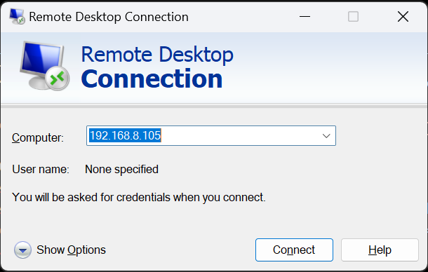
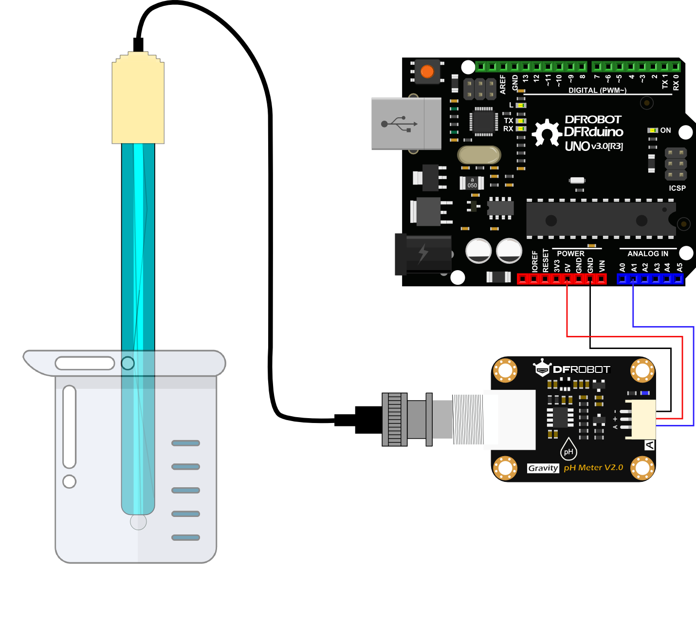
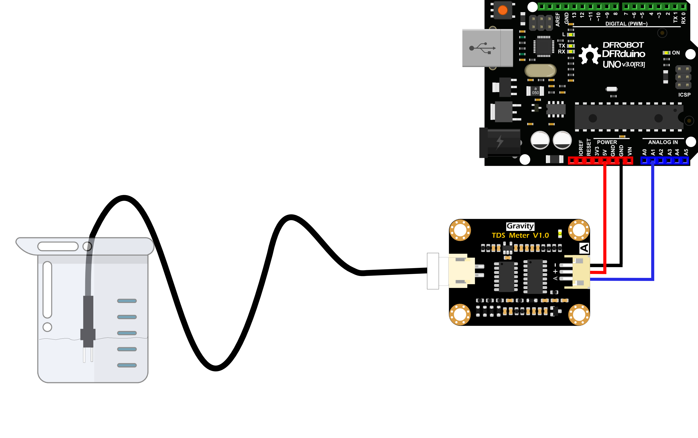

# Automation of Nutrition and Disease Detection in Hydroponic Spinach

## Intoduction

### I. Project Name
DESIGN AND IMPLEMENTATION OF AN AUTOMATIC NUTRITION AND DISEASE DETECTION SYSTEM FOR HYDROPONIC SPINACH PLANTS USING RASPBERRY PI

### II. Description
In addressing the challenge of meeting food requirements triggered by the increasing human population and decreasing agricultural land, hydroponic farming emerges as a solution for cultivating in limited spaces. Spinach, a plant with high economic value and widely favored by the community, can be grown using hydroponics, though it is susceptible to diseases. Proper management of the nutrient solution according to the plants' needs is a crucial factor in the success of hydroponic farming. With the application of IoT, managing nutrients and detecting diseases in hydroponic spinach becomes more efficient than doing so manually, which requires time, effort, and specialized skills. This research aims to develop an automation system for managing nutrients and detecting diseases in hydroponic spinach using the Nutrient Film Technique (NFT), utilizing a Raspberry Pi as the control center. The system monitors pH, nutrient content, temperature, humidity, and detects plant diseases using a Convolutional Neural Network (CNN) with a transfer learning architecture based on the MobileNetV2 model integrated with the Blynk dashboard. According to test results, the temperature and humidity sensors, pH sensors, and nutrient sensors have an accuracy above 97%, and the MobileNetV2 model used has an accuracy of 57% in detecting diseases in hydroponic spinach through images captured by a camera.  
**Keywords: *CNN, hydroponic, IoT, smart farming, spinach***

### III. Project Objectives
1. Designing a nutrient delivery automation system in hydroponic spinach farming NFT method by optimizing nutrient and water delivery to ensure plants get their needs quickly and precisely.  
2. Developing a disease detection mechanism for hydroponic spinach plants using deep learning methods, enabling early prevention and treatment.  
3. Integrating the automation system of nutrient delivery and disease detection of hydroponic spinach plants to improve the effectiveness and efficiency of hydroponic plant management.  

### IV. Project Team
Ilham Muhammad Sakti

### V. Project Start & End Dates
March 2024 - July 2024


## Methodology

### I. Tools & Materials

#### Hardware
| Item | Description |
| ---- | ----- |
| Raspberry Pi 4B | As a microcomputer. Used to manage automatic nutrient delivery and deployed plant disease detection model. |
| 32GB MicroSD | As a medium for storing the Raspberry Pi operating system. |
| ADC Module 1115 | To convert analog signals to digital signals.
| TDS DFRobot Sensor (SEN0244 Gravity Analog TDS Meter) | Sensor to read nutrient concentration (ppm) in hydroponic nutrient solution. | 
| PH DFRobot Sensor (SEN0161 Gravity Analog pH Sensor Meter Kit V2) | Sensor to read the pH content of the hydroponic nutrient solution. |
| Temperature and Humidity Sensor (SHTC3) | Sensor to read the temperatur and humidity of the hydroponic area installation. |
| Pi Camera Module 3 12MP | Used to take pictures of hydroponic plants with the the purpose of detecting diseases in these plants. |
| Micro Water Pump R385 | Serves to flow nutrient solutions to plants and mix the nutrient solution by flowing pH down, nutrients a, nutrient b, and water to the nutrient solution reservoir. |
| Relay Module 12V | Used to control the pumps (water, pH down, nutrient a, and nutrient b) as needed. |
| Power Supply 12V | Used to supply the electric power of the pump (water, pH down, nutrient a, and nutrient b). | 

#### Software
| Item | Description | 
| ---- | ----------- | 
| Blynk (web dashboard) | To display predictions of plant disease classification, temperature & humidity values, and pH & ppm content of nutrient solutions. |
| BlynkLib (library) | To send data from Raspberry Pi to Blynk. |
| adafruit-circuitpython-ads1x15 (packages) [version 2.2.25] | Driver for Adafruit's ADS1x15 ADC (Analog-to-Digital Converters) used with CircuitPython. |
| adafruit-circuitpython-shtc3 (packages) [version 1.1.14] | Driver for the SHTC3 temperature and humidity sensor from Adafruit used with CircuitPython. |
| RPi.GPIO (packages) [version 0.7.1] | Library to control GPIO (General Purpose Input/Output) pins on Raspberry Pi. |
| tflite-runtime (packages) [version 2.14.0] | A runtime for running TensorFlow Lite models on devices with limited resources, such as microprocessors or edge devices. |
| image (packages) [version 1.5.33] | Library for manipulating and processing images. |
| pillow (packages) [version 10.3.0] | An image processing library that is the successor to PIL (Python Imaging Library).
| numpy (packages) [version 1.26.4] | Library for scientific computing in Python, providing support for multidimensional arrays and various high-level math functions. |
| pytz (packages) [version 2024.1] | A library for handling time zones in Python, making it easy to convert between different time zones. |

### II. System Architecture
  
The design of the system that will be developed in this research aims to be able to monitor and provide nutrients and pH automatically to conduct early detection of diseases in hydroponic spinach plants. The main idea of the system is to interface several sensors with Raspberry Pi and forward the data (pH, PPM, and temperature) obtained from the sensors to Blynk. The data obtained is displayed on the Blyk dashboard through the website and Blynk application. While in detecting the disease using MobileNetV2. The dataset used in this research is obtained from the internet on the website https://universe.roboflow.com/.

This research uses the Nutrient Film Technique (NFT) technique in growing spinach hydroponically which is very suitable for vegetable cultivation. The advantage of this method lies in the ability to supply oxygen that is more quickly absorbed by the roots, thanks to the continuous and rapid water circulation process. This allows the plant to absorb nutrients more and more easily resulting in better plant growth. There are two types of pumps used, the mini pump and the main pump. The main pump is used to drain the nutrient solution from the reservoir to the hydroponic spinach plants and the micro pump is used to add liquids, such as A/B mix nutrients, pure water and pH down to the reservoir according to the nutritional needs of the plants. 

### III. Schematics Diagram
  

### IV. Flowchart System
  
For the automatic nutrient delivery system, it starts with the Raspberry Pi reading the pH value, nutrient content (PPM), temperature and humidity through the pH sensor, TDS sensor, and TDS sensor. 15 SHTC3 SENSOR. Then the pH content is checked. The ideal pH value for hydroponic spinach plants is 6.0 to 7.0. The ideal pH value for hydroponic spinach plants is 6.0 to 7.0. If the pH is less than 6, the water pump water pump is turned on for 3 seconds to raise the pH of the nutrient solution. However, if the pH is more than 7, If the pH is more than 7, then the pH pump is turned on for 1 second to lower the pH. Next, the nutrient content is checked. checking the nutrient content. The ideal PPM value for hydroponic spinach plants is at least 900, but in this research I used a PPM value of 1000. If PPM is less than 1000, the Raspberry Pi will turn on the nutrient pumps A and B for 2 seconds to increase the nutrient content. increase the nutrient content.

### V. Flowchart Build Model
  
In the model building process, the first step is to load the dataset, then divide the dataset into three parts, namely train data, validation data, and test data. Augmentation is performed on train data by rotating, shifting images horizontally and vertically, and enlarging or reducing images. After that, data preprocessing is done by changing the size to 320x320 pixels. Build a CNN model using the sequential API from TensorFlow. The model consists of several layers of convolution, ReLU activation, pooling, flattening, dense, and dropout. After that, the model evaluation is carried out to calculate the accuracy, recall, precisiom, and F1-score values. Then save the model in tflite format and deploy the model to Raspberry Pi. For details of the model building process can be seen in the figure above. 

### VI. Usage
#### A. Connect the Raspberry Pi with the computer
**With Cable**  
1. Use a microHDMI to HDMI & Video Capture cable to connect the Raspberry Pi with a computer as shown below.   
      
2. Open the OBS Studio app.
3. Select the source and double-click "Video Capture Device".
4. Select the "USB Video" device and click "Activate" and click "OK".  
      
5. Use a mouse and keyboard to operate the Raspberry Pi.

**Remote**
1. To access the Raspberry Pi remotely, you can use XRDP.  
2. Update system packages & install XRDP
    ```bash
    sudo apt update
    sudo apt upgrade
    sudo apt install xrdp
    ```
3. Check the IP address of Raspbery Pi.  
    ```bash
    hostname -I
    or
    ip -br a
    ```  
4. Open the Remote Desktop Connection application and enter the Raspberry Pi IP then click “Connect” and “Yes” on the pop up afterwards.  
      
5. Login Raspberry Pi.  
      
6. Raspberry Pi can be directly operated through a computer.  

#### B. Calibration PH sensor and TDS sensor
**PH Sensor**  
->**Raspberry Pi**
1. Connect the Raspberry Pi with the pH sensor through the ADC module according to the [Schematics Diagram](#iii-schematics-diagram).
2. Clean the sensor probe and insert it into the buffer solution (pH 4.0 or 7.0).
3. Run the following [program code](./code/IoT/ph_calibrate.py), then the sensor will automatically calibrate.
> Make sure the adafruit-circuitpython-ads1x15 and DFRobot_PH libraries are installed.  

->**Arduino Uno**
1. Connect the Arduino with the pH sensor and upload [the following code](./code/IoT/ph_calibrate.ino) to the board, after that put it into the buffer solution (pH 4.0 or 7.0).
     
2. Run the code.
3. When the pH value is stable, enter the command `enterph` in the serial monitor to enter calibration mode.
4. Enter `calph` command in the serial monitor to start calibration. The program will automatically identify the buffer solution used. 
5. After calibration, enter the `exitph` command in the serial monitor to exit the calibration mode and save the calibration results.
6. Perform the previous steps on a different buffer solution from the previous step.
> Make sure the DFRobot_PH library is installed.

**TDS Sensor**  
->**Arduino Uno**
1. Connect the Arduino with the TDS sensor and upload [the following code](./code/IoT/tds_calibrate.ino).    
    
2. Clean the TDS probe then put it into the solution buffer and run the code.
3. After the ppm value is stable, enter the `enter` command in the serial monitor to enter the calibration mode.
4. Enter the command `cal:tds` to start calibration. The “tds” value is the ppm content read by the sensor in numeric form.
5. Enter the `exit` command to save the calibration results and exit the calibration mode. 
> Make sure the DFRobot Gravity TDS sensor library is installed. 

#### C. Connect the Camera with the Raspberry Pi
1. Connect the Raspberry Pi with the Pi Camera Module (ensure Raspberry Pi is turned off).  
    
2. Reboot Raspberry Pi.
3. Update system packages & update firmware and kernel.
    ```bash
    sudo apt update
    sudo apt upgrade
    sudo rpi-update
    ```
4. Make configuration changes to the `/boot/config.txt` or `/boot/firmware/config.txt` file by adding the following code, then reboot.
    ```bash
    # ubah start_x=1 menjadi
    camera_auto_detect=1
    
    # ubah gpu_mem=128 menjadi
    gpu_mem=256
    ```
5. Reboot Raspberry Pi.
6. Test the camera with the following command.
    ```bash
    libcamera-hello
    or
    rpicam-hello
    ```

#### D. Training Model


#### E. Sistem Pemberian Nutrisi Otomatis dan Deteksi Penyakit  

